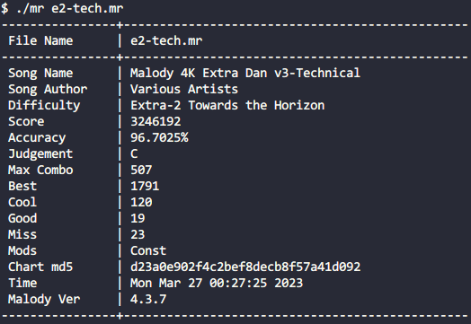
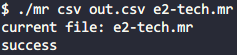
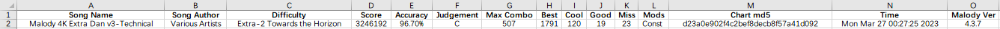

# MalodyReplayChecker
Malody 回放文件信息查看工具

## 使用方法

### 输出到命令行

在命令行下执行：`mr XXX.mr YYY.mr ...`，其中 `XXX.mr` `YYY.mr` 为回放文件，支持多文件。

例如：`mr a.mr` `mr a.mr b.mr c.mr`。

使用例：

### 生成 .csv 文件

> .csv 文件可以直接用 Excel 打开并编辑，方便管理。

在命令行下执行：`mr csv outfile.csv XXX.mr YYY.mr ...`，其中 `outfile.csv` 为生成文件名，`XXX.mr` `YYY.mr` 为回放文件，支持多文件。

例如：`mr csv out.csv a.mr`，`mr csv info.csv a.mr b.mr c.mr`。

使用例：

用 Excel 打开生成的 .csv 文件：

## 编译方法

### Windows

* 使用 Tiny C Compiler
    1. 下载 [Tiny C Compiler](https://bellard.org/tcc/) 编译器并添加到 PATH 目录。
    2. 在仓库根目录下运行 `make.bat`。

* 使用 MinGW（GCC）
    1. 下载安装。
    2. 在仓库根目录下执行 `gcc main.c func.c -o mr.exe -m32 -O3 -static -std=c11`。